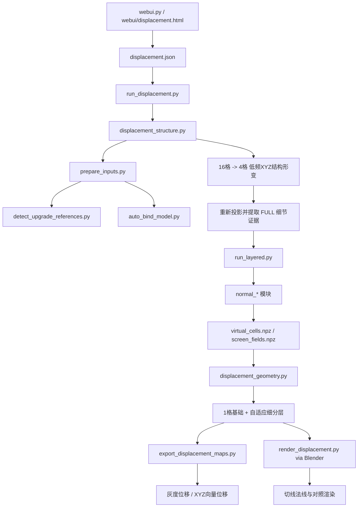

# 架构说明

这个项目把多张同一人脸、同一姿态/表情、不同主光方向的参考图，和一个已有 UV 的 OBJ 头模结合起来，先做低频三维大形修正，再从多光照残差中提取细节，最后输出真实高模、灰度位移、物体空间向量位移和烘焙法线。

当前主线由 `run_displacement.py` 驱动。仓库里仍保留了一些早期 normal/refine/upgrade 模块，因为当前实现直接复用了其中的几何、配准、语义遮罩和可视化函数；这些文件仍是运行依赖。

## 总体数据流



## 入口层

### `webui.py`

本地 HTTP UI，默认监听 `127.0.0.1:7861`。它负责读取/保存配置、校验主要参数、启动独立工作流子进程、汇总日志和结果预览。首次 clone 后如果没有 `displacement.json`，会从 `displacement.example.json` 自动生成一份本地配置。

### `run_displacement.py`

主编排器控制一次完整任务：

1. 校验输出目录和位移参数。
2. 可选执行低频结构修正。
3. 生成或复用与输入哈希绑定的 FULL 证据。
4. 在真实三角网格上逐层求位移并按残差自适应细分。
5. 写出最终 OBJ/NPZ 和报告。
6. 非 `--geometry-only` 模式下导出位移贴图，并调用 Blender 烘焙法线和渲染对照图。

## 输入绑定与相机标定

### `prepare_inputs.py`

把“OBJ + 参考图”转换成后续求解需要的绑定数据，并调用：

- `detect_upgrade_references.py`：检测参考图人脸关键点。
- `auto_bind_model.py`：调用外部 SOAP/head selection 环境，把图像关键点绑定到源模型顶点/重心坐标。

生成的 `prepared_config.json` 保存参考图检测结果、源模型绑定、材质范围和相机初始化等信息。

`automatic_inputs.detector_python` 和 `automatic_inputs.soap_root` 是机器相关的外部依赖路径，必须由本地配置显式提供。

## 低频结构修正

### `displacement_structure.py`

结构阶段先在较粗的拓扑分组上求连续 XYZ 位移场，默认两级：

- `16`：每组最多约 16 个源网格面，解决脸型和大体块。
- `4`：进一步收紧到五官局部结构。

每一级都会重新投影当前几何、估计多光照法线约束，再联合关键点/轮廓和平滑项求解。它保留源模型拓扑、UV 和原始顶点对应关系。

相关基础模块：

- `normal_geometry.py`：OBJ 读取、相机、栅格化、邻接、切线等几何基础。
- `normal_geometry_field.py`：几何观测、积分高度场和稀疏求解。
- `normal_multilight.py` / `normal_shading.py`：多光照配准、光照拟合和法线估计。
- `normal_structure.py`：语义区域与线状结构辅助。
- `run_upgrade.py` / `run_refine.py`：当前主线仍使用其中的配准置信度、语义遮罩和 montage 等函数。

## FULL 细节证据

低频结构修正完成后，系统用修正后的模型重新投影参考图，再运行 `run_layered.py` 提取细节证据。主要模块包括：

- `normal_layers.py`：low/mid/high/lips 多尺度层分解与合成。
- `normal_reference_fusion.py`：跨参考图匹配与融合。
- `normal_semantic_layers.py`：fold/wrinkle/fine 等语义结构层。
- `normal_pores.py`：可选毛孔处理。

结果以 `virtual_cells.npz`、`screen_fields.npz`、结构 JSON 和诊断图等形式保存。缓存键包含输入哈希和关键算法配置，避免不同模型/图片的证据混用。

## 网格位移与自适应细分

### `displacement_geometry.py`

核心数据结构：

- `Surface`：当前顶点、参考位置、法线方向、三角面、UV、材质和层级关系。
- `Evidence`：从屏幕空间提取并映射到网格的细节证据。

每层通过稀疏系统求法向位移，并根据剩余误差、支持度、像素尺度和几何预算决定哪些三角面继续线性细分。父顶点可以冻结，使新增层主要解释更高频的剩余误差。

这里的细分是线性三角细分，不是 Catmull-Clark。

## 输出与烘焙

### `export_displacement_maps.py`

把几何结果烘焙到 UV：

- `displacement_16.png`：相对精修基础模型的法向细节位移。
- `vector_displacement_16.png`：相对原始模型的 XYZ 物体空间总位移。
- `.npy`：float32 毫米数据。
- `*_decode.json`：量程、单位、零点和坐标解释。

### `render_displacement.py`

通过 Blender 的 `bpy` 运行，生成最终场景、切线法线贴图以及不同阶段的对照渲染。`bpy` 不属于 `requirements.txt`，由 Blender 自带 Python 提供。

## 目录与数据契约

```text
displacement.example.json   可提交的示例配置
displacement.json           本机运行配置；Git 忽略
webui/                      浏览器端 UI
output/                     每次运行结果；Git 忽略
cache/                      哈希绑定的中间证据；Git 忽略
backup/                     本地历史备份；Git 忽略
docs/                       当前架构、工作流和 UI 文档
```

一次典型输出：

```text
output/<run>/
├─ structure/               原始、16格、4格结构模型和结构报告
├─ evidence_full/           FULL 多光照细节证据
├─ levels/                  level_00 ... level_N 几何层
├─ maps/<material>/         总位移、向量位移、最终法线
├─ layer_maps/              每级增量贴图
├─ scene/                   Blender 场景和对照渲染
├─ head_displaced.obj       最终高模
├─ head_displaced.npz       几何与位移数值数据
└─ report.json              本次运行的最终报告
```

## 外部依赖边界

Python 包依赖只有 NumPy、SciPy、Pillow。完整自动流程另外需要：

1. 能运行参考图关键点检测的 Python 环境。
2. SOAP/head selection 源码目录，并至少包含 `headlab_geometry.py`。
3. Blender，用于最终烘焙和渲染。

这些路径都属于机器配置，不提交到仓库。

## 当前限制

- 输入假设是同一人物、相近姿态/表情、不同主光方向的多张参考图。
- 光源方向来自估计，不是标定测量。
- 结构阶段主要靠关键点/轮廓和光度约束，没有完整侧面深度真值。
- 局部面翻转检查不能证明最终网格绝对没有全局自相交。
- 8K 是输出采样分辨率，不会创造参考图中不存在的真实细节。

更细的当前工作流参数和输出解释见 `WORKFLOW.md`。
